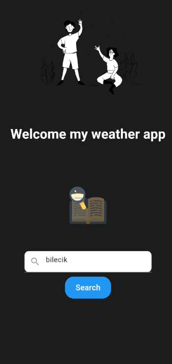
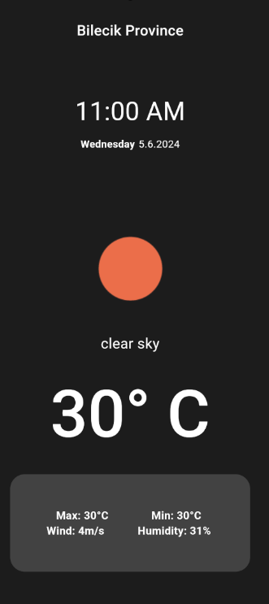

# Weather Aplication

## Project Description
A simple weather query application created using the OpenWeather API. The application allows users to search for weather information.

## Screenshots
### Home Screen


### Loading Screen


### Result Screen


## Resources and Websites Used

- Lottie Animations: [Lottie Files](https://lottiefiles.com/)
  - To add the Lottie library to Flutter:
    Open the terminal and run:
    ```bash
    flutter pub add lottie
    ```

- API Site: [OpenWeatherMap](https://openweathermap.org/)
