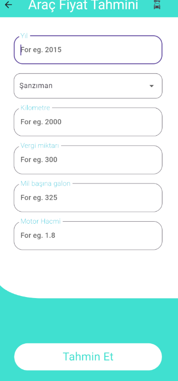
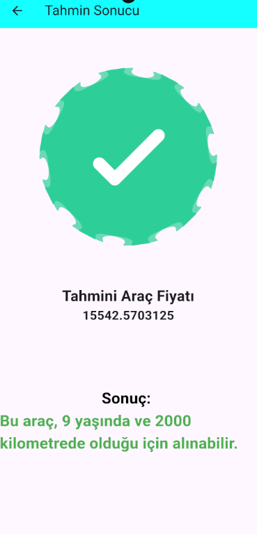

# Araç Fiyat Tahmin Uygulaması

## Proje Açıklaması
Farklı araç modellerinin çeşitli özelliklerine dayanarak fiyatlarını tahmin eden basit bir araç fiyat tahmin uygulaması.

## Ekran Görüntüleri
#### Ekranlar
<table align="center">
  <tr>
    <td align="center" style="width: 25%; padding: 10px;">
      
      <br><strong>Ana Ekran</strong>
    </td>
    <td align="center" style="width: 25%; padding: 10px;">
      
      <br><strong>Form Ekranı</strong>
    </td>
    <td align="center" style="width: 25%; padding: 10px;">
      
      <br><strong>Sonuç Ekranı</strong>
    </td>
  </tr>
</table>

## Kaynaklar

- Lottie Animasyonları: [Lottie Files](https://lottiefiles.com/)
  - Lottie kütüphanesini Flutter'a eklemek için:
    Terminali açın ve şu komutu çalıştırın:
    ```bash
    flutter pub add lottie
    ```

## Özellikler

- Detaylı veri seti analizi
- Eksik veri kontrolü
- Vites türlerine göre dağılım analizi
- Araçların yaş dağılımı (2024 yılına göre)
- İlan tarihlerine göre dağılım analizi
- Fiyat ile kilometre arasındaki ilişkinin incelenmesi
- Şanzıman türleri için sayısal kodlama: Otomatik (1), Manuel (2), Yarı Otomatik (3), Diğer (4)
- Farklı makine öğrenimi algoritmaları kullanılarak model eğitimi:
  - Doğrusal Regresyon
  - Karar Ağacı Regresyonu
  - Rastgele Orman Regresyonu
  - K-En Yakın Komşu (KNN) Regresyonu
  - XGBoost Regresyonu

## Flask API

Flask api ile kullanımı gerçekleştirildi model eğitim dosyasına ulaşmak isterseniz [repo linki](https://github.com/lvntaslann/car_price_predict_model).
