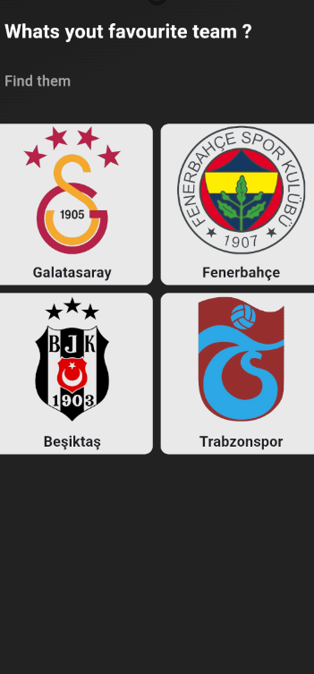
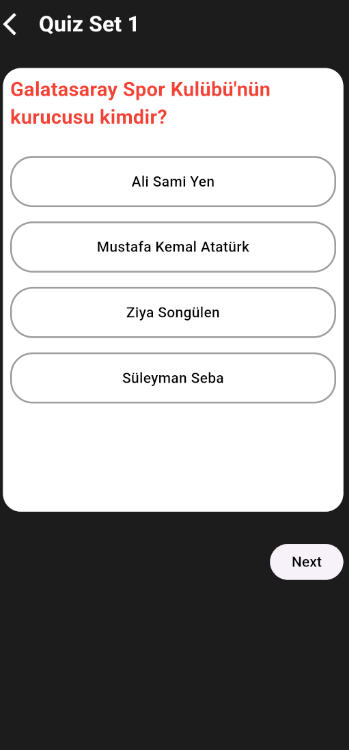
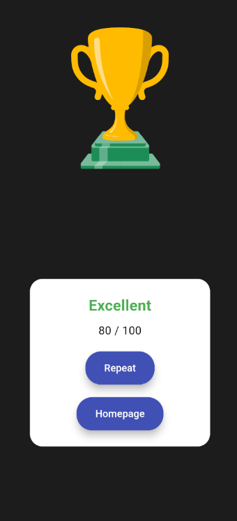

# Quiz App

## Project Description
A simple quiz application about the four major football teams in the Turkish league.

## Screenshots
#### Screens
<table align="center">
  <tr>
    <td align="center" style="width: 25%; padding: 10px;">
      
      <br><strong>Home Screen</strong>
    </td>
    <td align="center" style="width: 25%; padding: 10px;">
      
      <br><strong>Choose Screen</strong>
    </td>
    <td align="center" style="width: 25%; padding: 10px;">
      
      <br><strong>Questions Screen</strong>
    </td>
    <td align="center" style="width: 25%; padding: 10px;">
      
      <br><strong>Result Screen</strong>
    </td>
  </tr>
</table>

## Resources 

- Lottie Animations: [Lottie Files](https://lottiefiles.com/)
  - To add the Lottie library to Flutter:
    Open the terminal and run:
    ```bash
    flutter pub add lottie
    ```
